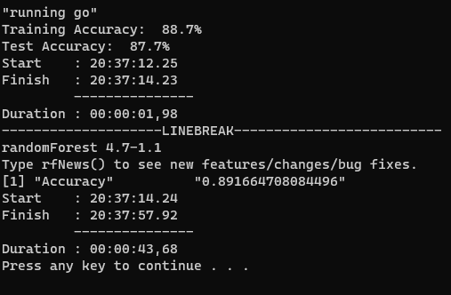

# Generative AI and Go

## Project Summary

For week 10 we were tasked with using a metthod from Gelman and Vehtari (2021). We chose to explore overparameterized models, specifically what happens if we implement a random forest with a substantial number of nodes and a small amount of trees based on the example from Belkin et al (2019). Belkin et Al (2019) claim that that over parameterizing in machine learning causes a double dip where at a certain point the overfitting breaks and continues the desired loss curve. 

As the process is memory and time expensive, we ran this test in R and Go in as close of a head-to-head match up as possible. 

## Findings

### *Go malaschitz/randomForest*
- - - -
We chose the randomForest package by mlaschitz for its convenience. Unforunately, this package has some limitations on node sizing and lacks a lot of the customizations from the R package. Node size is capped at 50 even if it is set higher. So we're not able to get a true example of an overparameterized model like in Belkin et al's example.

Finding this package was a little tough. ML seems to have hit a rough patch for Go packages. 

### *R randomForest*
- - - - 
The randomForest library in R is a fully fleshed out package with a great deal of customizability as detailed in the documentation. The documentation is great with the R tradition of long PDFs giving examples + explanations. I prefer this over repos with sparse comments in the code and short readmes/incomplete wikis. 

Package was extremely easy to find and comes highly recommended through multiple levels of search results pages.

### Overall Results
- - - -

Go was about 26x faster to run with a runtime of about 2 seconds to load, model, print the accuracy.

R took about 44 seconds to load, model, print the accuracy.

## Overall Recommendation

The company should not implement the project as is. The company should look to deploying trained models in Go for production ready work using m2cgen to convert a built model to Go. This package gives the best of both worlds. We can use R or Python to leverage a substantially more robust ML package to create a comprehensive model with rigorous testing done.

Then once the model is good, m2cgen can convert all the coefficients and determinors into Go.

With the converted model, the pipeline can be set up in Go to feed the model and use the results. 

## Folder Setup

*main.go:* \
The script for the randomforest in golang with nodesize = 50 and trees = 20.

*rf_in_r.R:* \
The script for the randomforest in R with nodesize = 2000 and trees = 20.

## Instructions

To recreate this analysis:

1. download the mnist data in csv from this website https://pjreddie.com/projects/mnist-in-csv/ and add it to the data folder OR use the getdata.bat script in the datafolder
2. run the runall.bat file to execute both the R script and the Go script

## References

Belkin, Mikhail, Daniel Hsu, Siyuan Ma, Soumik Mandal. 2019. "Reconciling modern machine learning practice and the bias-variance trade-off" 1-23. https://arxiv.org/pdf/1812.11118.pdf

Gelman, Andrew, and Aki Vehtari. 2022. “What Are the Most Important Statistical Ideas of the Past 50 Years?" Journal of the American Statistical Association, 116: 2087–2097. Available online at https://arxiv.org/abs/2012.00174Links to an external site.

https://github.com/malaschitz/randomForest/tree/master

https://github.com/BayesWitnesses/m2cgen/tree/master

https://cran.r-project.org/web/packages/randomForest/randomForest.pdf