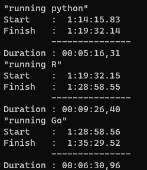
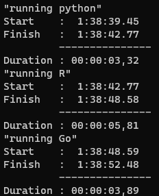

# Batch Job Speed Test

## Project Summary

For Week 4 we were tasked to create a Go script that replicated the describe() functionality of Pandas and the summary() functionality of R.

For this project we replicated all 7 summary statistics: count, mean, standard deviation, min, max, 1st quartile, median, and 3rd quartile

A few key issues we ran into:

1. Windows Defender

When executing the go file, we ran into a slowdown where Windows Defender was actively scanning during the execution. This might be related to an issue documented here: https://betterprogramming.pub/a-big-problem-in-go-that-no-one-talks-about-328cc3e71378. Preferably, we'd be executing all of these tests in a Linux/MacOs unix environment. 

2. Script and Test Design

The script as is doesn't leverage a lot of Go's strengths as we created this to mimic the read -> store -> describe structure of the py/R files. 

With more time to develop this, there should be a lot of gains in speed. Reading in the CSV async might be one optimization for this as order doesn't really matter here. Calculations could also theoretically be done concurrently with the only non-async part being the data sort and the count. Finding the breakpoint for where concurrency offers a speed gain instead of a loss will be critical.

Gerardi's colStatsv.3 provides a solid framework. See the folder colStats.v3 for Gerardi's base files. A question is to loop through and fire the summary functions as this program was designed to take in 1 input at a time for the column or do we fully revamp the program and create additional channels? Another design question is with Gerardi's structure, do we keep the same style as Pandas as load up the data into the object or write directly to the file? A cost consideration here would be in keeping the file open the writing to specific places without causing issues with the async write.  

Also, the way that the test is done by firing the script repeatedly 100x is most likely a bottleneck, especially with Windows. 

## Findings

### 100 Runs

Python is the fastest here by a small margin. R is notably slower than Python and Go in processing this. 

### 1 Run

Python is the fastest here by a small margin again. 

## Go Setup

*week4/csv_read.go:* \
This go file contains all of our supporting functions to read in the csv and calculate the various summary statistics. Note we follow the pandas.describe() functionalty for calculating Q1/Q3. Results may differ if using a different method, exclusive/inclusive, and so on. 

*main.go:* \
This go file is our main file. It contains the main structs to house the data and contains the write to file function. 

## References

Gerardi, Ricardo. 2021. Powerful Command-Line Applications in Go: Build Fast and Maintainable Tools. Raleigh, NC: The Pragmatic Bookshelf. [ISBN-13: 978-1-68050-696-9] Foreword by Steve Francis (pages xi–xiii), Chapter 5 Improving the Performance of Your CLI Tools (pages 111–162), and Chapter 7 Using the Cobra CLI Framework (pages 213–271). Available on Course Reserves.
