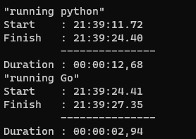

# Web Scraping with Go

## Project Summary

For Week 5 we were tasked to create a Go script that replicated the web scraping functionality of Scrapy in python.

For this project we were able to replicate downloading the entire page as an html file and writing the title, url, and text to a JSON line separated file. However we were not able to replicate the tags scraping functionality of Scrapy.

This project was done entirely with the standard library for Go to prove the robustness of the standard library and the speed of the standard library.

For future deployments, additional third-party packages should be used to simplify the process.

## Findings

The python script took about 12.68 seconds to run while the go script managed a blazing fast time of 2.94 seconds. 

## Go Setup

*main.go:* \
This go file is our main file. It contains the main structs to house the data and contains the write to file function. 

For this project, everything was hosted in the main file for simplicity. Future projects should breakout the variety of functions to modules.

The critical crawler components were built by Amit Saha in Chapter 3 & 4 from Practical Go: Building Scalable Network & Non-network Applications. 

## References

Saha, Amit. 2022. Practical Go: Building Scalable Network & Non-network Applications. New York: Wiley. ISBN-13: 978-1-119-77381-8. Chapter 3 Writing HTTP Clients (pages 57–80) and Chapter 4 Advanced HTTP Clients (pages 81–104). Available from Course Reserves.

