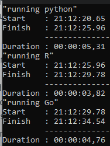

# Isolation Forests with Go

## Project Summary

For week 7 we were tasked with conducting analysis on anomalies using isolation forests with Go.

For this week, we chose the package go-iforest by https://github.com/e-XpertSolutions/go-iforest. We chose this package primarily because there were updates made to the repo in within the last year and setup was extremely simple with the GoMNIST package. We could also configure this almost exactly like the isolation forests provided for us in Python and R. Other packages lacked some of the features and were quitte finicky with the input data.

## Findings

Running the data in Go, we noticed something odd. Instead of the results being centered around 0.5 the numbers were setup around 0.0. In the provided python and R packages, the behaviour was that the outputs would be setup around 0.5. 

Additional trouble shooting will be required to step in and compare the go-iforest calculation against sci-kit learn's implementation. At first glance they seem nearly equal with the calculations being fairly similar with .5 - (2 ** (mean depth) / average path length) https://github.com/e-XpertSolutions/go-iforest/blob/master/iforest/iforest.go#L90 vs https://github.com/scikit-learn/scikit-learn/blob/a24c8b464d094d2c468a16ea9f8bf8d42d949f84/sklearn/ensemble/iforest.py#L286.

Overall the go execution was middle of the road.

Go does run signifcantly faster when using go-iforests TestParallel, which levereages concurrency, instead of Test with times clocking in under just 2 seconds. However, the program as is does not handle the indexing very well which makes comparing results hard as the order changes. Future iterations should leverage TestParallel.

## Go-based isolation forests as part of its data processing pipeline

With how quickly Go can process this, the company should implement this into the data-processing pipeline for anomaly detection. Given that 60,000 samples were crunched in under two seconds with TestParallel, which also includes the slow process of reading the data and writing the results, the anomaly detection should be very light on resource consumption while being extremely fast. For batch or streaming loads, the program should be almost weightless with the smaller amounts of data being processed. 

This will help ensure that numerical data is monitored on ingest and allow warnings to be sent to the proper teams for investigation. We can also leverage go-iforest's auto labeler which is left unconfigured for this example. By setting the treshold, the the result can be flagged and a sample sent out with the warning so that business and engineering teams can check that the inbound data is good. This can be very useful for marketing teams to prevent overcounting/undercounting. 

## Go Setup

*.:* \
Root folder contains the go program + testing. Program loads data from the MNIST data set. 

Once the data is loaded, we convert into a float64 matrix then feed that into go-iforest's 

*./results:* \
Go program data housed here

*./data:* \
MNIST hand-written numbers data here

*jump-start-mnist-iforest-main:* \
Contains the given packages to compare against. /r contains the R files. /Python contains the python files. /data contains the MNIST data. /results contain the results for python + r.

## Instructions

To recreate this analysis please run the do_all.bat file which will fire and time the three different scripts. 

## References

https://github.com/e-XpertSolutions/go-iforest/tree/master

https://github.com/scikit-learn/scikit-learn/blob/a24c8b46/sklearn/ensemble/iforest.py
